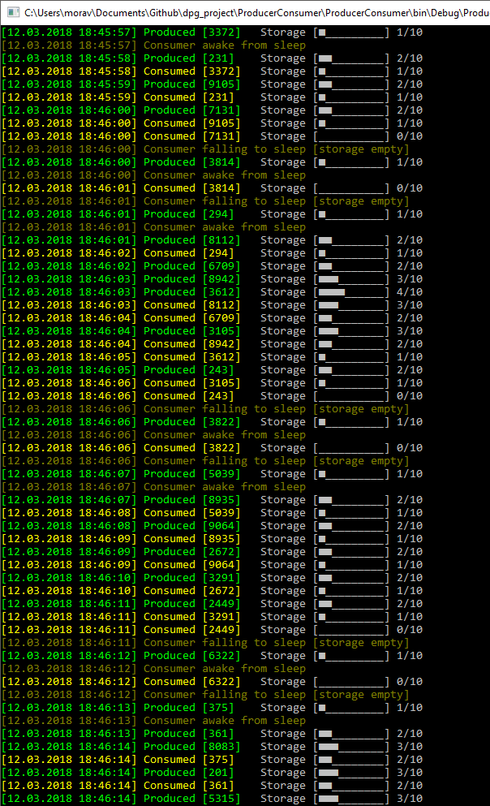
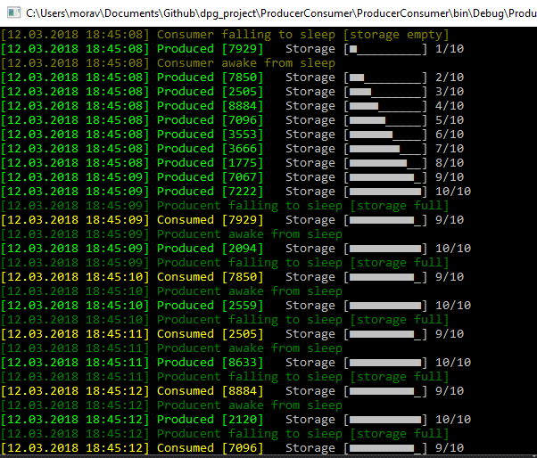

# Producer–consumer problem

## Solved in C# with implemented:
* Random delays between producer and consumer work
* Adjustable delays between producer and consumer work
* Unlimited maximum size of buffer
* Threads (wait, pulse, thread safe)
* Locks (monitor)

